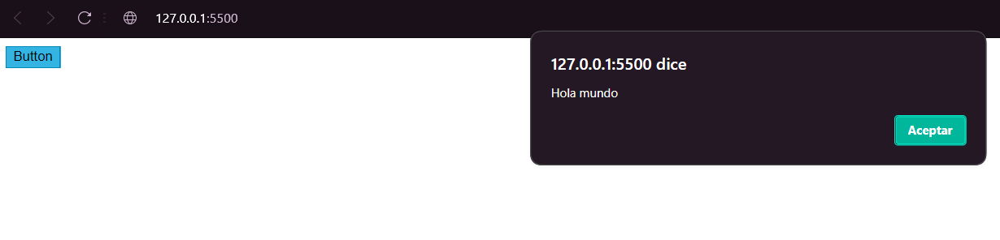
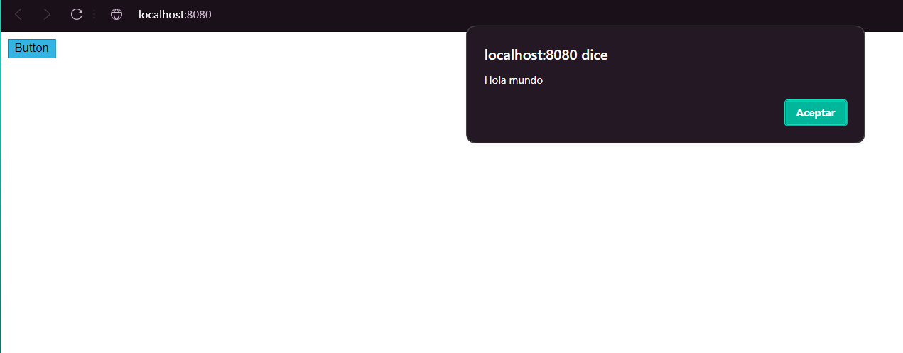

# HolaJavaScript

## This is the results
<p align="center">
    
</p>
 
 ## How to use
 ### Pre-requisites
* VSCode editor
* VSCode Live Server extension

### Run local
* Clone the repository
 ```
 https://github.com/FranchescoAC/holajavascript.git
```

* Once the project has been cloned, you must open it with the VSCode code editor.
* After clicking on "Go live" at the bottom right.
* A search engine will automatically open with the selected port.

<p align="center">
    
</p>

## How to run in docker
### Pre-requisites

* Docker - DockerDesktop installed
* DockerHub account

### Download image
* Open the visual code terminal and enter the following code
```
docker pull franchescoac/holajavascriptd
```
### Run image
* In the same terminal, enter the following command line
```
docker run --name <NEWCONTAINERNAME> -d -p 8080:80 <IMAGENAME>
```
* In which "NEWCONTAINERNAME" is the name of the container to be named and "IMAGENAME" is the image to be created
```
Example:  docker run -d --name container1 -p 8080:80 holajavascript
```
### View the results
Open new window browser and search "localhost:8080"

<p align="center">
    
</p>

### Link RAILWAY
* Use this link to see the program running on RAILWAY
```
holajava-production.up.railway.app
```

### View the results
Open new window browser and search "localhost:80"
